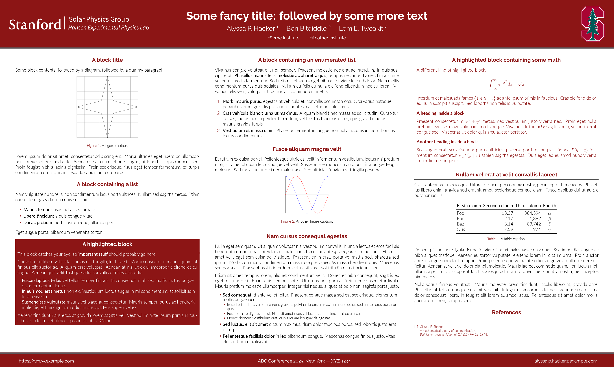
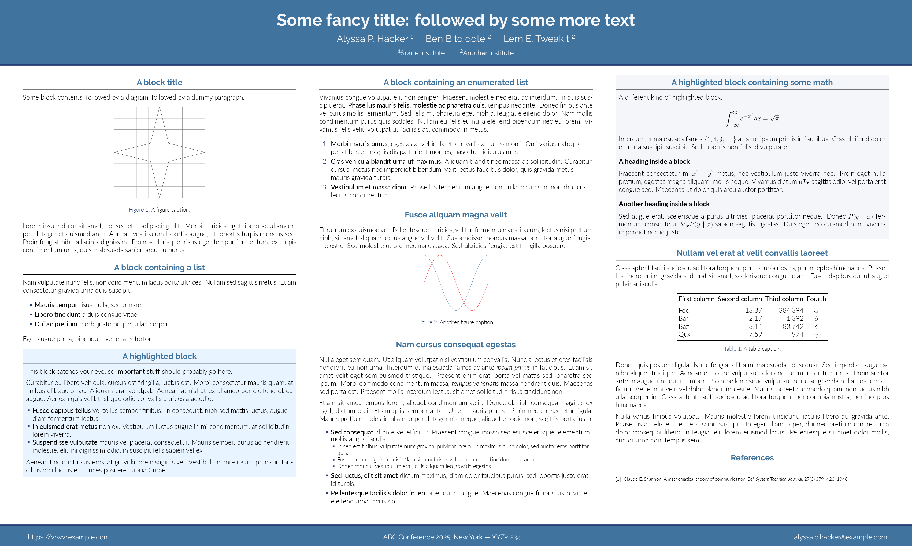
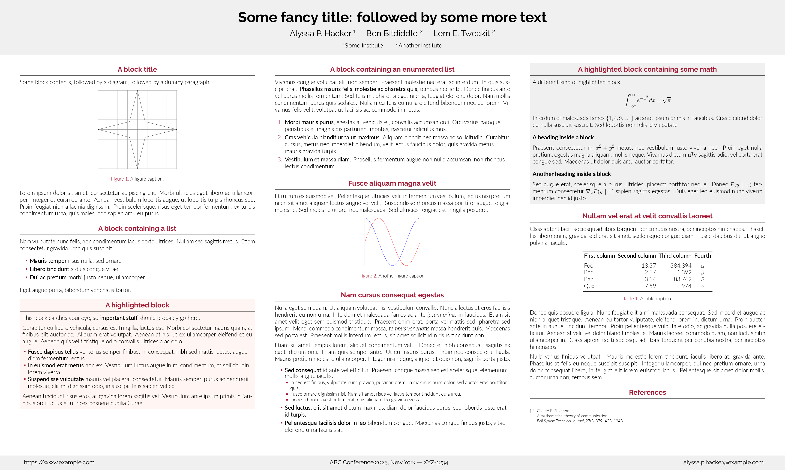
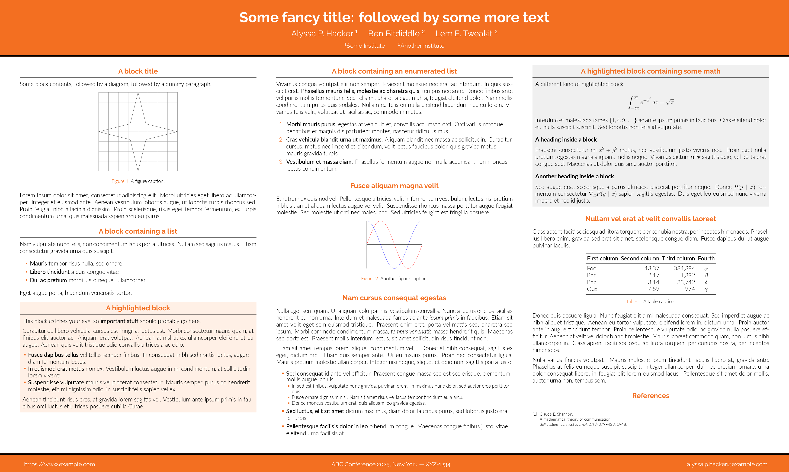

# Stanford Gemini 

Stanford Gemini is a modern LaTeX [beamerposter] theme based on the original
[Gemini] project.

If you're looking for a beamer presentation theme, take a look at [Auriga].

> [!NOTE]
> We do not currently have a version of [Auriga] for our group yet.

## Dependencies

* A TeX installation that includes [LuaTeX]
  * You also need `latexmk` if you want to use the provided `Makefile`
  * Ubuntu install example:
    * `sudo apt install texlive-latex-extra texlive-fonts-recommended texlive-fonts-extra lmodern texlive-luatex texlive-xetex latexmk`
  * RHEL install example:
    * `sudo dnf install texlive-collection-fontsrecommended texlive-collection-fontsextra texlive-collection-latexextra latexmk`
* LaTeX package dependencies including beamerposter (these usually come with
  your TeX installation, but if not, you can get them from [CTAN])
* [Raleway] and [Lato], which are both available under Open Font License

## Usage

1. Copy the files in this repository (or clone the repository)

1. In `poster.tex`, set up your paper size, column layout, and scale the
   content as necessary

1. Run `make clean && make` to build your poster

## FAQ

At the moment, we **do not** have our own Wiki or FAQ for this project.
However, please see the [FAQ] from the original project, as it may answer some
of the questions.

Here are some tips you may want to be aware of those:
- By default, the `stanford` style is used in the `poster.tex` file.
  If you would like to make your own style, please read the original project's
  Wiki and [FAQ].
- We provide several logos for Stanford and our group in the `logos` directory.
  If you would like to modify which logo you'd like to use, look for the Logo
  section in the `poster.tex` file to make your changes.
  By default, we use Stanford + our group name and the Stanford Tree at the top.

## Themes

Gemini currently includes three color themes:

* `stanford` (default)
* `gemini`
* `mit`
* `labsix`

The alternative themes are intended to be inspiration for you to make your own
color theme.
You're highly recommended to make your own color theme (it's really easy!)
or use the default Stanford theme.
To use one of the other themes, simply update the line `usecolortheme{}` in
`poster.tex` to one of the above mentioned themes.
Or use your own theme, e.g. `awesome` (assuming your theme is in the file
`beamercolorthemeawesome.sty`)

### Classic (Gemini) theme

### MIT theme

### LabSix theme

## Contributing

Contributions such as bug reports, new themes, and new poster components are
always welcome!
Open an issue or pull request early if you'd like feedback when implementing a
new feature or theme.

## License

Copyright (c) Alex Koufos. Released under the MIT License. See
[LICENSE.md][license] for details.

[beamerposter]: https://github.com/deselaers/latex-beamerposter
[Gemini]: https://github.com/anishathalye/gemini
[Auriga]: https://github.com/anishathalye/auriga
[LuaTeX]: http://www.luatex.org/
[CTAN]: https://ctan.org/
[Raleway]: https://www.fontsquirrel.com/fonts/raleway
[Lato]: https://www.fontsquirrel.com/fonts/lato
[license]: LICENSE.md
[FAQ]: https://github.com/anishathalye/gemini/wiki/FAQ
